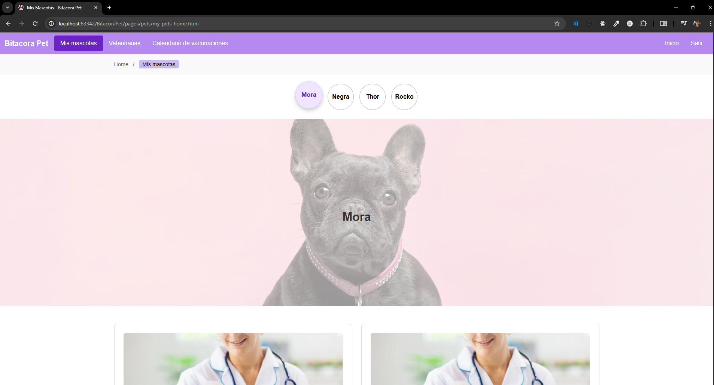
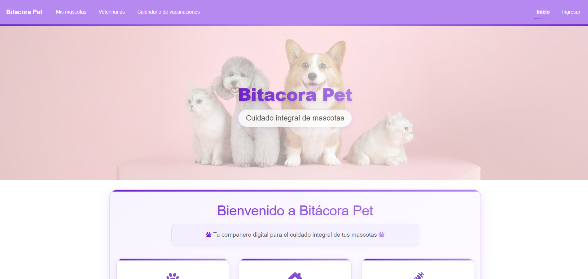
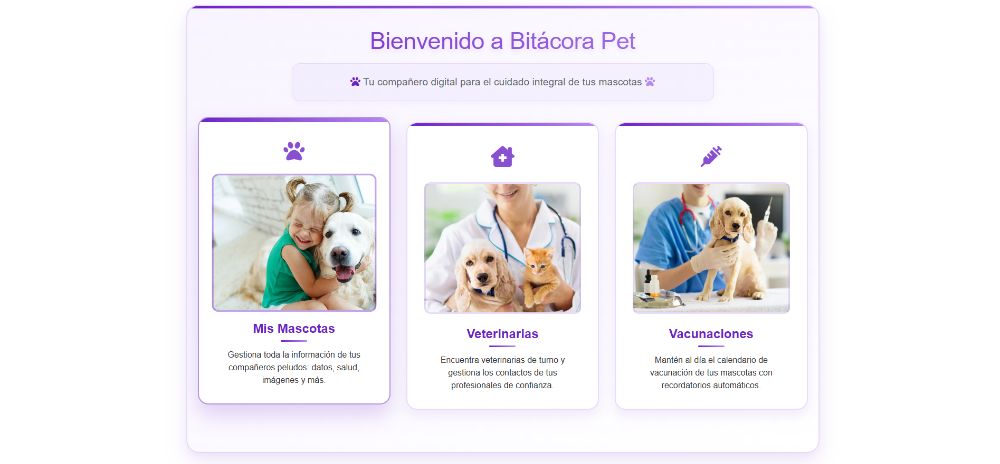
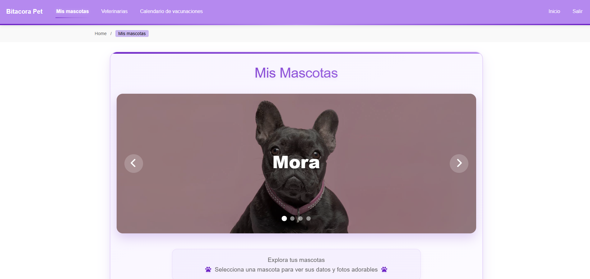
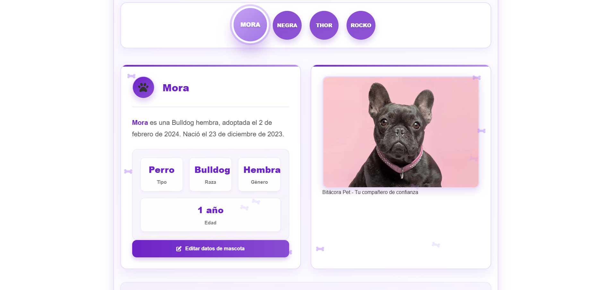
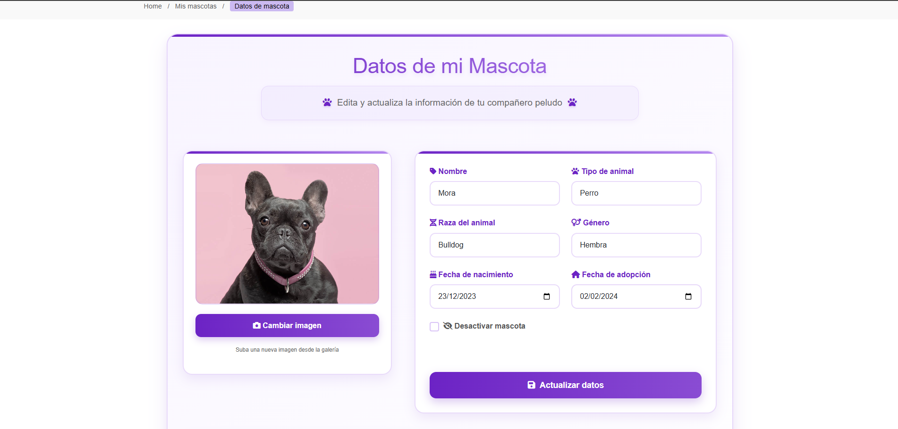

# Bitacora Pet

## Desarrollo Web - Coderhouse 2025

### Link de Github Pages

[Bitacora Pet - Github Pages](https://martiigarcia.github.io/BitacoraPet/)

## Imagen de evolucion del sitio

### Version 1:


### Version 2:




### Version 3:







Comando ejecutado para estilos:

```
sass --watch .\assets\scss\styles.scss .\assets\css\style.css
```