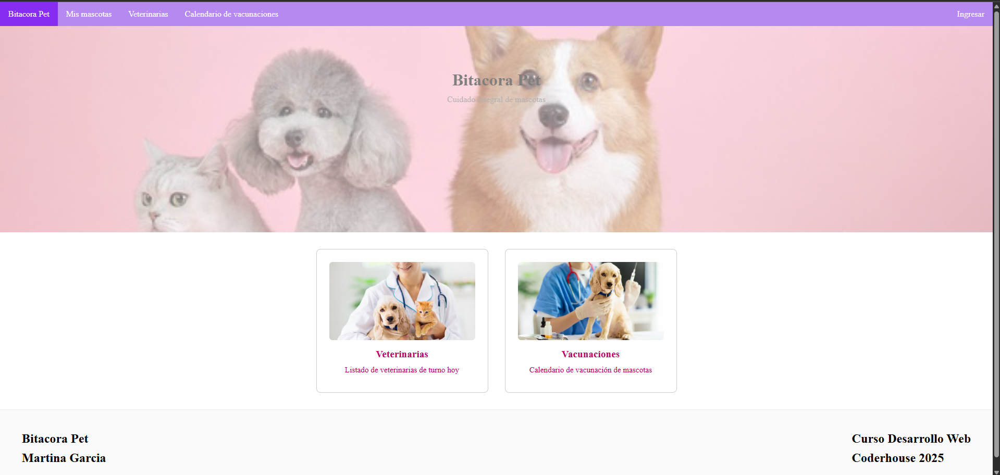
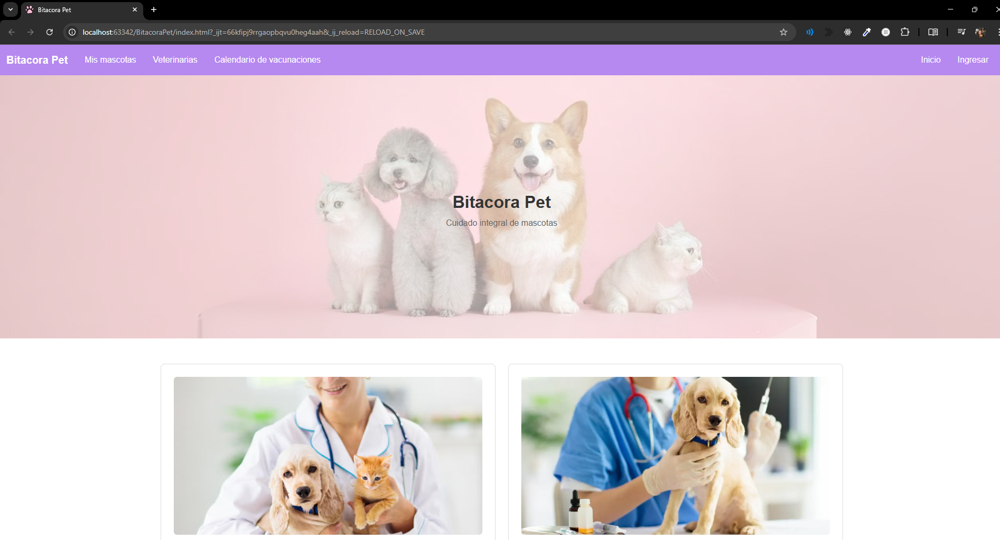

# Bitacora Pet

## Desarrollo Web - Coderhouse 2025

### Link de Github Pages:
<a href="https://martiigarcia.github.io/BitacoraPet/" target="_blank">https://martiigarcia.github.io/BitacoraPet/</a>

### Imagen sitio:

Version 1:

Version 2:

Comando ejecutado: 

sass --watch .\assets\scss\styles.scss .\assets\css\style.css